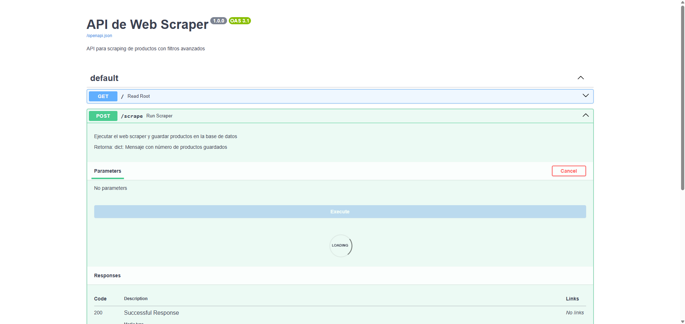
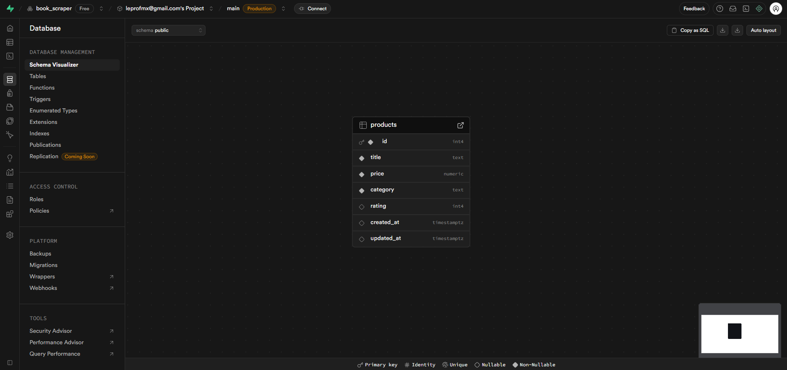
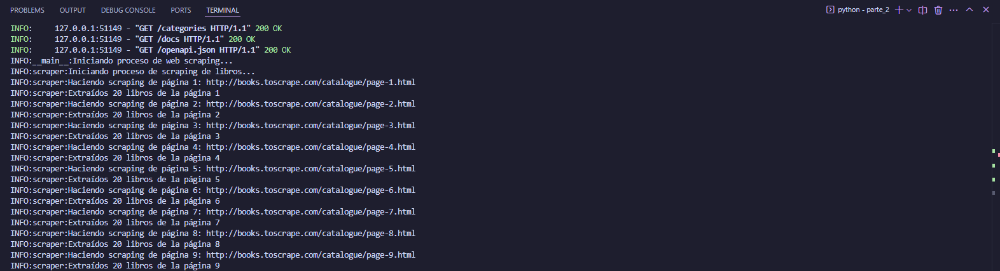
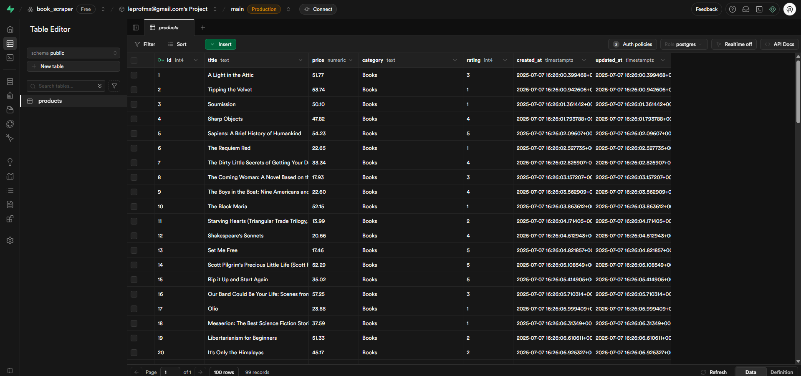

# Web Scraper API con Supabase

API de scraping de productos que extrae información de libros y la almacena en Supabase.

## Características

- 🕷️ Web scraping robusto con manejo de errores
- 🗄️ Base de datos Supabase con PostgreSQL
- 🔍 Filtros avanzados por título, categoría y precio
- 📊 API REST documentada con FastAPI
- 🛡️ Seguridad con Row Level Security (RLS)
- 📈 Logging detallado para monitoreo

## Configuración

1. **Instalar dependencias:**
   ```bash
   pip install -r requirements.txt
   ```

2. **Configurar Supabase:**
   - Las variables de entorno se configurarán automáticamente

3. **Ejecutar migraciones:**
   Las migraciones se aplicarán automáticamente cuando conectes Supabase

## Uso

### Iniciar el servidor
```bash
python main.py
```

## Documentación Visual

### 1. Interfaz de Documentación Interactiva
La API incluye documentación interactiva generada automáticamente por FastAPI. Accede a `http://localhost:8000/docs` para probar los endpoints directamente desde el navegador.



*Interfaz de FastAPI donde puedes probar el endpoint POST /scrape y todos los demás endpoints de forma interactiva.*

### 2. Esquema de Base de Datos
La estructura de la base de datos en Supabase con la tabla `products` y sus políticas de seguridad.



*Vista del esquema de la base de datos en Supabase mostrando la tabla products con sus columnas, índices y políticas RLS.*

### 3. Proceso de Scraping en Consola
El scraper proporciona logging detallado durante su ejecución para monitorear el progreso.



*Salida de la consola mostrando el proceso de scraping en tiempo real con información detallada de cada página procesada.*

### 4. Datos Insertados en la Base de Datos
Los productos extraídos se almacenan automáticamente en Supabase.



*Vista de la tabla products en Supabase con los datos de libros insertados después del scraping.*

## Endpoints Disponibles

### `POST /scrape`
Ejecuta el scraper y guarda los productos en la base de datos.

**Respuesta:**
```json
{
  "message": "Scraping completado exitosamente",
  "total_scrapeado": 1000,
  "productos_nuevos_guardados": 850,
  "duplicados_omitidos": 150
}
```

### `GET /products`
Obtiene productos con filtros opcionales.

**Parámetros de consulta:**
- `title`: Filtrar por título (búsqueda parcial)
- `category`: Filtrar por categoría
- `min_price`: Precio mínimo
- `max_price`: Precio máximo
- `limit`: Número máximo de resultados (default: 100)

**Ejemplo:**
```
GET /products?title=python&min_price=10&max_price=50&limit=20
```

**Respuesta:**
```json
{
  "productos": [
    {
      "id": 1,
      "title": "Learning Python",
      "price": 29.99,
      "category": "Books",
      "rating": 4,
      "created_at": "2025-01-27T10:00:00Z"
    }
  ],
  "cantidad": 1,
  "filtros_aplicados": {
    "title": "python",
    "min_price": 10,
    "max_price": 50,
    "limit": 20
  }
}
```

### `GET /categories`
Obtiene todas las categorías disponibles.

**Respuesta:**
```json
{
  "categorias": ["Books", "Electronics", "Clothing"],
  "cantidad": 3
}
```

### `GET /docs`
Accede a la documentación interactiva de la API donde puedes probar todos los endpoints.

### `GET /health`
Endpoint de verificación de estado del servicio.

**Respuesta:**
```json
{
  "estado": "saludable",
  "servicio": "API de Web Scraper"
}
```

## Estructura de la Base de Datos

### Tabla `products`
- `id`: Clave primaria auto-incremental
- `title`: Título del producto (indexado)
- `price`: Precio con precisión decimal (10,2)
- `category`: Categoría del producto (indexado)
- `rating`: Calificación de 0-5 estrellas (con validación)
- `created_at`: Fecha de creación (automática)
- `updated_at`: Fecha de actualización (automática)

### Índices
- `idx_products_title`: Índice en el campo título para búsquedas rápidas
- `idx_products_category`: Índice en categoría para filtros eficientes
- `idx_products_price`: Índice en precio para rangos de búsqueda

## Características de Robustez

- **Manejo de errores**: Captura y registra errores de red y parsing
- **Límites de páginas**: Previene loops infinitos (máximo 50 páginas)
- **Delays aleatorios**: Respeta el servidor objetivo (1-3 segundos entre peticiones)
- **Timeouts**: Evita conexiones colgadas (10 segundos)
- **Validación de datos**: Verifica la integridad antes de guardar
- **Logging detallado**: Facilita el debugging y monitoreo
- **Detección de duplicados**: Evita insertar productos ya existentes

## Seguridad

- **Row Level Security (RLS)** habilitado en todas las tablas
- **Políticas de acceso granulares**:
  - Lectura pública para usuarios anónimos y autenticados
  - Escritura restringida al rol de servicio
- **Variables de entorno** para credenciales sensibles
- **Validación de parámetros** de entrada en todos los endpoints
- **Headers de User-Agent** para evitar bloqueos del scraper

## Cómo Probar la API

1. **Inicia el servidor:**
   ```bash
   python main.py
   ```

2. **Accede a la documentación interactiva:**
   ```
   http://localhost:8000/docs
   ```

3. **Ejecuta el scraper:**
   - En `/docs`, busca `POST /scrape`
   - Haz clic en "Try it out" → "Execute"

4. **Consulta los productos:**
   ```
   http://localhost:8000/products
   ```

5. **Aplica filtros:**
   ```
   http://localhost:8000/products?category=Books&min_price=10&max_price=30
   ```

## Tecnologías Utilizadas

- **FastAPI**: Framework web moderno y rápido
- **Supabase**: Base de datos PostgreSQL como servicio
- **BeautifulSoup4**: Parsing de HTML para web scraping
- **Requests**: Cliente HTTP para peticiones web
- **Uvicorn**: Servidor ASGI de alto rendimiento
- **Python-dotenv**: Gestión de variables de entorno